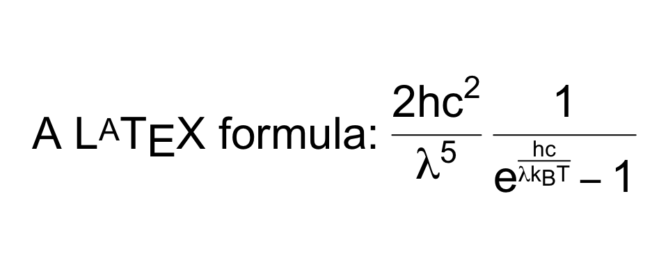

<!-- badges: start -->

[](https://github.com/stefano-meschiari/latex2exp/actions)
<!-- badges: end -->

# latex2exp

## Overview

**latex2exp** is an R package that parses and converts LaTeX to R’s
custom [plotmath
expressions](http://stat.ethz.ch/R-manual/R-patched/library/grDevices/html/plotmath.html).

Expressions returned by `latex2exp` can be used to create formatted text
and mathematical formulas and symbols to be rendered as axis labels,
annotations, legends, titles, etc. throughout R’s plotting system.

## Installation

Install this package from CRAN:

``` r
install.packages('latex2exp')
```

You can also install the development version from GitHub using
[devtools](http://cran.r-project.org/web/packages/devtools/index.html):

``` r
devtools::install_github('stefano-meschiari/latex2exp')
```

## Usage

The `TeX` function takes a LaTeX string, parses it, and returns the
closest [plotmath
expression](http://stat.ethz.ch/R-manual/R-patched/library/grDevices/html/plotmath.html)
suitable for use in graphics. The return value of `TeX()` can be used
anywhere a plotmath expression is accepted, including plot labels,
legends, and text for both base graphics and ggplot2.

Here’s a simple example:

``` r
# Use raw strings, no need to escape backslashes.
TeX(r"(\textbf{Euler's identity} is $e^{i\pi} = 0$.)")
```

Since R 4.0, it is recommended to use the new raw string literal syntax
(see `?Quotes`). The syntax looks like `r"(...)"`, where `...` can
contain any character sequence, including `\`.

Another option is to escape the backslash character (`\`) for LaTeX
commands, such that the command will be written as `\\command` rather
than `\command`. This will also work on versions of R older than 4.0:

``` r
# Equivalent to the previous code fragment.
# Use regular strings, but escape the backslashes.
TeX("\\textbf{Euler's identity} is $e^{i\\pi} = 0$.")
```

You can quickly preview what a translated LaTeX string would look like
by using `plot`:

``` r
plot(TeX(r'(A $\LaTeX$ formula: $\frac{2hc^2}{\lambda^5}\frac{1}{e^{\frac{hc}{\lambda k_B T}} - 1}$)'), cex=2, main="")
```



The following example shows plotting in base graphics:

``` r
x <- seq(0, 4, length.out=100)
alpha <- 1:5

plot(x, xlim=c(0, 4), ylim=c(0, 10), 
     xlab='x', ylab=TeX(r'($\alpha  x^\alpha$, where $\alpha \in \{1 \ldots 5\}$)'), 
     type='n', main=TeX(r'(Using $\LaTeX$ for plotting in base graphics!)', bold=TRUE))

for (a in alpha) {
  lines(x, a*x^a, col=a)
}

legend('topleft', 
       legend=TeX(sprintf(r'($\alpha = %d$)', alpha)), 
       lwd=1, 
       col=alpha)
```


This example shows plotting in [ggplot2](https://ggplot2.tidyverse.org):

``` r
x <- seq(0, 4, length.out=100)
alpha <- 1:5
data <- map_df(alpha, ~ tibble(v=.*x^., x=x, alpha=.))

p <- ggplot(data, aes(x=x, y=v, color=as.factor(alpha))) +
    geom_line() + 
    ylab(TeX(r'($\alpha  x^\alpha$, where $\alpha \in 1\ldots 5$)')) +
    ggtitle(TeX(r'(Using $\LaTeX$ for plotting in ggplot2. I $\heartsuit$ ggplot!)')) +
    coord_cartesian(ylim=c(-1, 10)) +
    guides(color=guide_legend(title=NULL)) +
    scale_color_discrete(labels=lapply(sprintf(r'($\alpha = %d$)', alpha), TeX)) 
    # Note that ggplot2 legend labels must be lists of expressions, not vectors of expressions

print(p)
```


Here are a few examples of what you can do with **latex2exp**:

``` r
latex2exp_examples(cex=0.9)
```


## Supported LaTeX commands

Run

``` r
latex2exp_supported(TRUE)
```

to see an interactive, searchable table of LaTeX commands supported.
