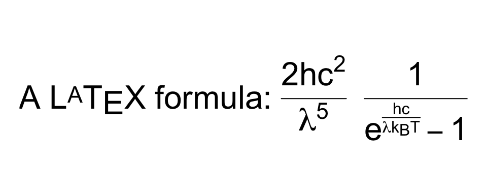
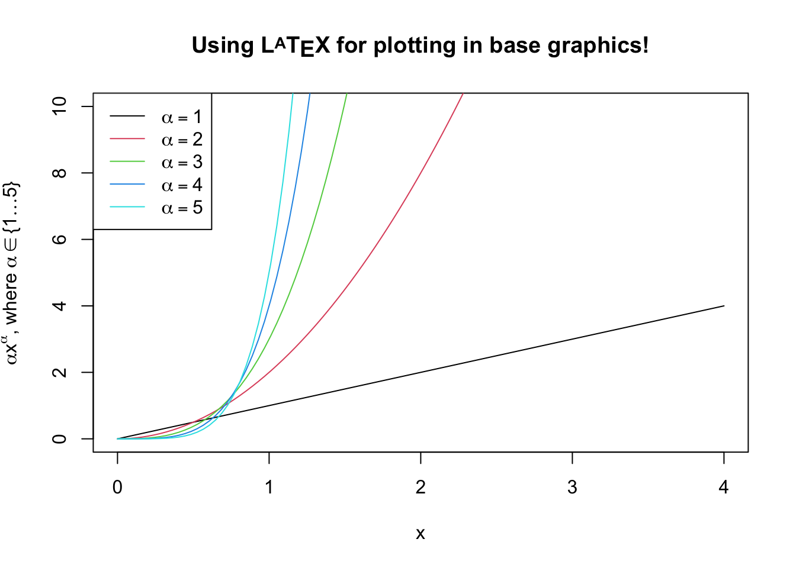
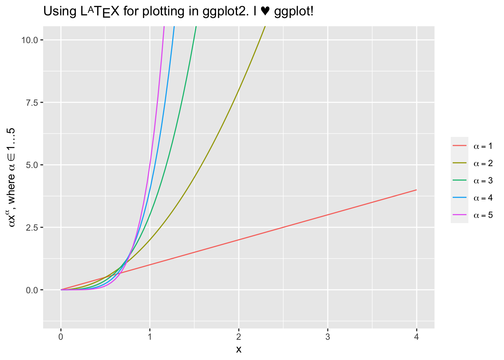
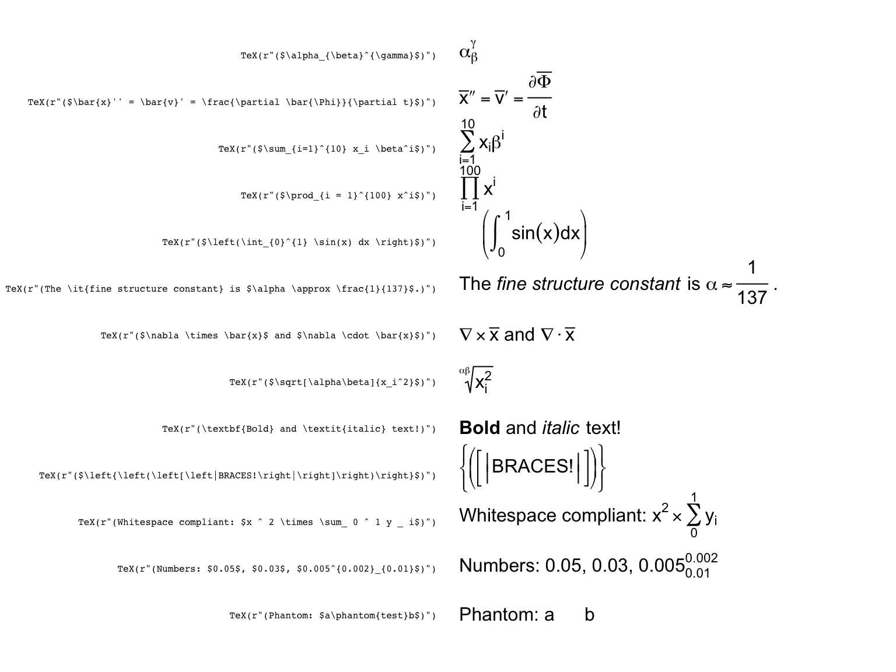
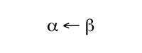
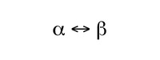
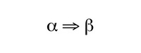
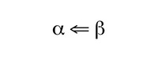
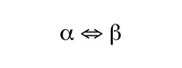
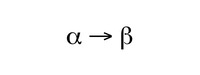

<!-- badges: start -->
[](https://github.com/stefano-meschiari/latex2exp/actions)
<!-- badges: end -->

# latex2exp

**latex2exp** is an R package that parses and converts LaTeX to R’s
custom [plotmath
expressions](http://stat.ethz.ch/R-manual/R-patched/library/grDevices/html/plotmath.html).

Expressions returned by `latex2exp` can be used to create formatted text
and mathematical formulas and symbols to be rendered as axis labels,
annotations, legends, titles, etc. throughout R’s plotting system.

## Installation

Install this package from CRAN:

``` r
install.packages('latex2exp')
```

You can also install from GitHub using
[devtools](http://cran.r-project.org/web/packages/devtools/index.html):

``` r
devtools::install_github('stefano-meschiari/latex2exp')
```

## Usage

The `TeX` function takes a LaTeX string, parses it, and returns the
closest [plotmath
expression](http://stat.ethz.ch/R-manual/R-patched/library/grDevices/html/plotmath.html)
suitable for use in graphics. The return value of `TeX()` can be used
anywhere a plotmath expression is accepted, including plot labels,
legends, and text for both base graphics and ggplot2.

Here’s a simple example:

``` r
# Use raw strings, no need to escape backslashes.
TeX(r"(\textbf{Euler's identity} is $e^{i\pi} = 0$.)")
```

Since R 4.0, it is recommended to use the new raw string literal syntax
(see `?Quotes`). The syntax looks like `r"(...)"`, where `...` can
contain any character sequence, including `\`.

Another option is to escape the backslash character (`\`) for LaTeX
commands, such that the command will be written as `\\command` rather
than `\command`. This will also work on versions of R older than 4.0:

``` r
# Equivalent to the previous code fragment.
# Use regular strings, but escape the backslashes.
TeX("\\textbf{Euler's identity} is $e^{i\\pi} = 0$.")
```

You can quickly preview what a translated LaTeX string would look like
by using `plot`:

``` r
plot(TeX(r'(A $\LaTeX$ formula: $\frac{2hc^2}{\lambda^5} \, \frac{1}{e^{\frac{hc}{\lambda k_B T}} - 1}$)'), cex=2, main="")
```



The following example shows plotting in base graphics:

``` r
x <- seq(0, 4, length.out=100)
alpha <- 1:5

plot(x, xlim=c(0, 4), ylim=c(0, 10), 
     xlab='x', ylab=TeX(r'($\alpha  x^\alpha$, where $\alpha \in \{1 \ldots 5\}$)'), 
     type='n', main=TeX(r'(Using $\LaTeX$ for plotting in base graphics!)', bold=TRUE))

for (a in alpha) {
  lines(x, a*x^a, col=a)
}

legend('topleft', 
       legend=TeX(sprintf(r'($\alpha = %d$)', alpha)), 
       lwd=1, 
       col=alpha)
```



This example shows plotting in [ggplot2](https://ggplot2.tidyverse.org):

``` r
x <- seq(0, 4, length.out=100)
alpha <- 1:5
data <- map_df(alpha, ~ tibble(v=.*x^., x=x, alpha=.))

p <- ggplot(data, aes(x=x, y=v, color=as.factor(alpha))) +
    geom_line() + 
    ylab(TeX(r'($\alpha  x^\alpha$, where $\alpha \in 1\ldots 5$)')) +
    ggtitle(TeX(r'(Using $\LaTeX$ for plotting in ggplot2. I $\heartsuit$ ggplot!)')) +
    coord_cartesian(ylim=c(-1, 10)) +
    guides(color=guide_legend(title=NULL)) +
    scale_color_discrete(labels=lapply(sprintf(r'($\alpha = %d$)', alpha), TeX)) 
    # Note that ggplot2 legend labels must be lists of expressions, not vectors of expressions

print(p)
```



Here are a few examples of what you can do with **latex2exp**:

``` r
invisible(latex2exp_examples(cex=0.9))
```



## Supported LaTeX commands

Run

``` r
latex2exp_supported(TRUE)
```

to see an interactive, searchable table of LaTeX commands supported.

<table>
<thead>
<tr>
<th>Category</th>
<th>LaTeX command</th>
<th>Example</th>
</tr>
</thead>
<tbody>
<tr>
<td>Greek Letters</td>
<td>
<pre>TeX(r"($\alpha$)")</pre>
</td>
<td>

</td>
</tr>
<tr>
<td>Greek Letters</td>
<td>
<pre>TeX(r"($\Alpha$)")</pre>
</td>
<td>

</td>
</tr>
<tr>
<td>Greek Letters</td>
<td>
<pre>TeX(r"($\beta$)")</pre>
</td>
<td>

</td>
</tr>
<tr>
<td>Greek Letters</td>
<td>
<pre>TeX(r"($\Beta$)")</pre>
</td>
<td>

</td>
</tr>
<tr>
<td>Greek Letters</td>
<td>
<pre>TeX(r"($\chi$)")</pre>
</td>
<td>

</td>
</tr>
<tr>
<td>Greek Letters</td>
<td>
<pre>TeX(r"($\Chi$)")</pre>
</td>
<td>

</td>
</tr>
<tr>
<td>Greek Letters</td>
<td>
<pre>TeX(r"($\delta$)")</pre>
</td>
<td>

</td>
</tr>
<tr>
<td>Greek Letters</td>
<td>
<pre>TeX(r"($\Delta$)")</pre>
</td>
<td>

</td>
</tr>
<tr>
<td>Greek Letters</td>
<td>
<pre>TeX(r"($\epsilon$)")</pre>
</td>
<td>

</td>
</tr>
<tr>
<td>Greek Letters</td>
<td>
<pre>TeX(r"($\Epsilon$)")</pre>
</td>
<td>

</td>
</tr>
<tr>
<td>Greek Letters</td>
<td>
<pre>TeX(r"($\eta$)")</pre>
</td>
<td>

</td>
</tr>
<tr>
<td>Greek Letters</td>
<td>
<pre>TeX(r"($\Eta$)")</pre>
</td>
<td>

</td>
</tr>
<tr>
<td>Greek Letters</td>
<td>
<pre>TeX(r"($\gamma$)")</pre>
</td>
<td>

</td>
</tr>
<tr>
<td>Greek Letters</td>
<td>
<pre>TeX(r"($\Gamma$)")</pre>
</td>
<td>

</td>
</tr>
<tr>
<td>Greek Letters</td>
<td>
<pre>TeX(r"($\iota$)")</pre>
</td>
<td>

</td>
</tr>
<tr>
<td>Greek Letters</td>
<td>
<pre>TeX(r"($\Iota$)")</pre>
</td>
<td>

</td>
</tr>
<tr>
<td>Greek Letters</td>
<td>
<pre>TeX(r"($\kappa$)")</pre>
</td>
<td>

</td>
</tr>
<tr>
<td>Greek Letters</td>
<td>
<pre>TeX(r"($\Kappa$)")</pre>
</td>
<td>

</td>
</tr>
<tr>
<td>Greek Letters</td>
<td>
<pre>TeX(r"($\lambda$)")</pre>
</td>
<td>

</td>
</tr>
<tr>
<td>Greek Letters</td>
<td>
<pre>TeX(r"($\Lambda$)")</pre>
</td>
<td>

</td>
</tr>
<tr>
<td>Greek Letters</td>
<td>
<pre>TeX(r"($\mu$)")</pre>
</td>
<td>

</td>
</tr>
<tr>
<td>Greek Letters</td>
<td>
<pre>TeX(r"($\Mu$)")</pre>
</td>
<td>

</td>
</tr>
<tr>
<td>Greek Letters</td>
<td>
<pre>TeX(r"($\nu$)")</pre>
</td>
<td>

</td>
</tr>
<tr>
<td>Greek Letters</td>
<td>
<pre>TeX(r"($\Nu$)")</pre>
</td>
<td>

</td>
</tr>
<tr>
<td>Greek Letters</td>
<td>
<pre>TeX(r"($\omega$)")</pre>
</td>
<td>

</td>
</tr>
<tr>
<td>Greek Letters</td>
<td>
<pre>TeX(r"($\Omega$)")</pre>
</td>
<td>

</td>
</tr>
<tr>
<td>Greek Letters</td>
<td>
<pre>TeX(r"($\omicron$)")</pre>
</td>
<td>

</td>
</tr>
<tr>
<td>Greek Letters</td>
<td>
<pre>TeX(r"($\Omicron$)")</pre>
</td>
<td>

</td>
</tr>
<tr>
<td>Greek Letters</td>
<td>
<pre>TeX(r"($\phi$)")</pre>
</td>
<td>

</td>
</tr>
<tr>
<td>Greek Letters</td>
<td>
<pre>TeX(r"($\Phi$)")</pre>
</td>
<td>

</td>
</tr>
<tr>
<td>Greek Letters</td>
<td>
<pre>TeX(r"($\pi$)")</pre>
</td>
<td>

</td>
</tr>
<tr>
<td>Greek Letters</td>
<td>
<pre>TeX(r"($\Pi$)")</pre>
</td>
<td>

</td>
</tr>
<tr>
<td>Greek Letters</td>
<td>
<pre>TeX(r"($\psi$)")</pre>
</td>
<td>

</td>
</tr>
<tr>
<td>Greek Letters</td>
<td>
<pre>TeX(r"($\Psi$)")</pre>
</td>
<td>

</td>
</tr>
<tr>
<td>Greek Letters</td>
<td>
<pre>TeX(r"($\rho$)")</pre>
</td>
<td>

</td>
</tr>
<tr>
<td>Greek Letters</td>
<td>
<pre>TeX(r"($\Rho$)")</pre>
</td>
<td>

</td>
</tr>
<tr>
<td>Greek Letters</td>
<td>
<pre>TeX(r"($\sigma$)")</pre>
</td>
<td>

</td>
</tr>
<tr>
<td>Greek Letters</td>
<td>
<pre>TeX(r"($\Sigma$)")</pre>
</td>
<td>

</td>
</tr>
<tr>
<td>Greek Letters</td>
<td>
<pre>TeX(r"($\tau$)")</pre>
</td>
<td>

</td>
</tr>
<tr>
<td>Greek Letters</td>
<td>
<pre>TeX(r"($\Tau$)")</pre>
</td>
<td>

</td>
</tr>
<tr>
<td>Greek Letters</td>
<td>
<pre>TeX(r"($\theta$)")</pre>
</td>
<td>

</td>
</tr>
<tr>
<td>Greek Letters</td>
<td>
<pre>TeX(r"($\Theta$)")</pre>
</td>
<td>

</td>
</tr>
<tr>
<td>Greek Letters</td>
<td>
<pre>TeX(r"($\upsilon$)")</pre>
</td>
<td>

</td>
</tr>
<tr>
<td>Greek Letters</td>
<td>
<pre>TeX(r"($\Upsilon$)")</pre>
</td>
<td>

</td>
</tr>
<tr>
<td>Greek Letters</td>
<td>
<pre>TeX(r"($\zeta$)")</pre>
</td>
<td>

</td>
</tr>
<tr>
<td>Greek Letters</td>
<td>
<pre>TeX(r"($\Zeta$)")</pre>
</td>
<td>

</td>
</tr>
<tr>
<td>Greek Letters</td>
<td>
<pre>TeX(r"($\Upsilon$)")</pre>
</td>
<td>

</td>
</tr>
<tr>
<td>Greek Letters</td>
<td>
<pre>TeX(r"($\varpi$)")</pre>
</td>
<td>

</td>
</tr>
<tr>
<td>Greek Letters</td>
<td>
<pre>TeX(r"($\varphi$)")</pre>
</td>
<td>

</td>
</tr>
<tr>
<td>Arithmetic Operators</td>
<td>
<pre>TeX(r"($\alpha + \beta$)")</pre>
</td>
<td>

</td>
</tr>
<tr>
<td>Arithmetic Operators</td>
<td>
<pre>TeX(r"($\alpha - \beta$)")</pre>
</td>
<td>

</td>
</tr>
<tr>
<td>Arithmetic Operators</td>
<td>
<pre>TeX(r"($\alpha / \beta$)")</pre>
</td>
<td>

</td>
</tr>
<tr>
<td>Arithmetic Operators</td>
<td>
<pre>TeX(r"($\alpha * \beta$)")</pre>
</td>
<td>

</td>
</tr>
<tr>
<td>Binary Operators</td>
<td>
<pre>TeX(r"($\alpha = \beta$)")</pre>
</td>
<td>

</td>
</tr>
<tr>
<td>Binary Operators</td>
<td>
<pre>TeX(r"($\alpha &gt; \beta$)")</pre>
</td>
<td>

</td>
</tr>
<tr>
<td>Binary Operators</td>
<td>
<pre>TeX(r"($\alpha &lt; \beta$)")</pre>
</td>
<td>

</td>
</tr>
<tr>
<td>Binary Operators</td>
<td>
<pre>TeX(r"($\alpha \neq \beta$)")</pre>
</td>
<td>

</td>
</tr>
<tr>
<td>Binary Operators</td>
<td>
<pre>TeX(r"($\alpha \geq \beta$)")</pre>
</td>
<td>

</td>
</tr>
<tr>
<td>Binary Operators</td>
<td>
<pre>TeX(r"($\alpha \leq \beta$)")</pre>
</td>
<td>

</td>
</tr>
<tr>
<td>Binary Operators</td>
<td>
<pre>TeX(r"($\alpha \div \beta$)")</pre>
</td>
<td>

</td>
</tr>
<tr>
<td>Binary Operators</td>
<td>
<pre>TeX(r"($\alpha \pm \beta$)")</pre>
</td>
<td>

</td>
</tr>
<tr>
<td>Binary Operators</td>
<td>
<pre>TeX(r"($\alpha \approx \beta$)")</pre>
</td>
<td>

</td>
</tr>
<tr>
<td>Binary Operators</td>
<td>
<pre>TeX(r"($\alpha \sim \beta$)")</pre>
</td>
<td>

</td>
</tr>
<tr>
<td>Binary Operators</td>
<td>
<pre>TeX(r"($\alpha \propto \beta$)")</pre>
</td>
<td>

</td>
</tr>
<tr>
<td>Binary Operators</td>
<td>
<pre>TeX(r"($\alpha \equiv \beta$)")</pre>
</td>
<td>

</td>
</tr>
<tr>
<td>Binary Operators</td>
<td>
<pre>TeX(r"($\alpha \cong \beta$)")</pre>
</td>
<td>

</td>
</tr>
<tr>
<td>Binary Operators</td>
<td>
<pre>TeX(r"($\alpha \in \beta$)")</pre>
</td>
<td>

</td>
</tr>
<tr>
<td>Binary Operators</td>
<td>
<pre>TeX(r"($\alpha \notin \beta$)")</pre>
</td>
<td>

</td>
</tr>
<tr>
<td>Binary Operators</td>
<td>
<pre>TeX(r"($\alpha \cdot \beta$)")</pre>
</td>
<td>

</td>
</tr>
<tr>
<td>Binary Operators</td>
<td>
<pre>TeX(r"($\alpha \times \beta$)")</pre>
</td>
<td>

</td>
</tr>
<tr>
<td>Binary Operators</td>
<td>
<pre>TeX(r"($\alpha \circ \beta$)")</pre>
</td>
<td>

</td>
</tr>
<tr>
<td>Binary Operators</td>
<td>
<pre>TeX(r"($\alpha \ast \beta$)")</pre>
</td>
<td>

</td>
</tr>
<tr>
<td>Binary Operators</td>
<td>
<pre>TeX(r"($\alpha \% \beta$)")</pre>
</td>
<td>

</td>
</tr>
<tr>
<td>Binary Operators</td>
<td>
<pre>TeX(r"($\alpha \perp \beta$)")</pre>
</td>
<td>

</td>
</tr>
<tr>
<td>Binary Operators</td>
<td>
<pre>TeX(r"($\alpha \bullet \beta$)")</pre>
</td>
<td>

</td>
</tr>
<tr>
<td>Binary Operators</td>
<td>
<pre>TeX(r"($\alpha \otimes \beta$)")</pre>
</td>
<td>

</td>
</tr>
<tr>
<td>Binary Operators</td>
<td>
<pre>TeX(r"($\alpha \oplus \beta$)")</pre>
</td>
<td>

</td>
</tr>
<tr>
<td>Binary Operators</td>
<td>
<pre>TeX(r"($\alpha \oslash \beta$)")</pre>
</td>
<td>

</td>
</tr>
<tr>
<td>Binary Operators</td>
<td>
<pre>TeX(r"($\alpha \vee \beta$)")</pre>
</td>
<td>

</td>
</tr>
<tr>
<td>Binary Operators</td>
<td>
<pre>TeX(r"($\alpha \wedge \beta$)")</pre>
</td>
<td>

</td>
</tr>
<tr>
<td>Binary Operators</td>
<td>
<pre>TeX(r"($\alpha \angle \beta$)")</pre>
</td>
<td>

</td>
</tr>
<tr>
<td>Binary Operators</td>
<td>
<pre>TeX(r"($\alpha \cdots \beta$)")</pre>
</td>
<td>

</td>
</tr>
<tr>
<td>Binary Operators</td>
<td>
<pre>TeX(r"($\alpha \ldots \beta$)")</pre>
</td>
<td>

</td>
</tr>
<tr>
<td>Set Operators</td>
<td>
<pre>TeX(r"($A \subset B$)")</pre>
</td>
<td>

</td>
</tr>
<tr>
<td>Set Operators</td>
<td>
<pre>TeX(r"($A \subseteq B$)")</pre>
</td>
<td>

</td>
</tr>
<tr>
<td>Set Operators</td>
<td>
<pre>TeX(r"($A \nsubset B$)")</pre>
</td>
<td>

</td>
</tr>
<tr>
<td>Set Operators</td>
<td>
<pre>TeX(r"($A \supset B$)")</pre>
</td>
<td>

</td>
</tr>
<tr>
<td>Set Operators</td>
<td>
<pre>TeX(r"($A \supseteq B$)")</pre>
</td>
<td>

</td>
</tr>
<tr>
<td>Set Operators</td>
<td>
<pre>TeX(r"($A \setminus B$)")</pre>
</td>
<td>

</td>
</tr>
<tr>
<td>Set Operators</td>
<td>
<pre>TeX(r"($A \cup B$)")</pre>
</td>
<td>

</td>
</tr>
<tr>
<td>Set Operators</td>
<td>
<pre>TeX(r"($A \cap B$)")</pre>
</td>
<td>

</td>
</tr>
<tr>
<td>Other Operators</td>
<td>
<pre>TeX(r"($\forall$)")</pre>
</td>
<td>

</td>
</tr>
<tr>
<td>Other Operators</td>
<td>
<pre>TeX(r"($\exists$)")</pre>
</td>
<td>

</td>
</tr>
<tr>
<td>Other Operators</td>
<td>
<pre>TeX(r"($\Im$)")</pre>
</td>
<td>

</td>
</tr>
<tr>
<td>Other Operators</td>
<td>
<pre>TeX(r"($\Re$)")</pre>
</td>
<td>

</td>
</tr>
<tr>
<td>Other Operators</td>
<td>
<pre>TeX(r"($\wp$)")</pre>
</td>
<td>

</td>
</tr>
<tr>
<td>Other Operators</td>
<td>
<pre>TeX(r"($\surd$)")</pre>
</td>
<td>

</td>
</tr>
<tr>
<td>Other Operators</td>
<td>
<pre>TeX(r"($\neg$)")</pre>
</td>
<td>

</td>
</tr>
<tr>
<td>Other Operators</td>
<td>
<pre>TeX(r"($\ni$)")</pre>
</td>
<td>

</td>
</tr>
<tr>
<td>Operators With Subscripts And Superscripts</td>
<td>
<pre>TeX(r"($\sqrt[z]{x+y}$)")</pre>
</td>
<td>

</td>
</tr>
<tr>
<td>Operators With Subscripts And Superscripts</td>
<td>
<pre>TeX(r"($\sum_{i=0}^{\infty}$)")</pre>
</td>
<td>

</td>
</tr>
<tr>
<td>Operators With Subscripts And Superscripts</td>
<td>
<pre>TeX(r"($\prod_{i=0}^{\infty}$)")</pre>
</td>
<td>

</td>
</tr>
<tr>
<td>Operators With Subscripts And Superscripts</td>
<td>
<pre>TeX(r"($\int_{i=0}^{\infty}$)")</pre>
</td>
<td>

</td>
</tr>
<tr>
<td>Operators With Subscripts And Superscripts</td>
<td>
<pre>TeX(r"($\bigcup_{i} A_i$)")</pre>
</td>
<td>

</td>
</tr>
<tr>
<td>Operators With Subscripts And Superscripts</td>
<td>
<pre>TeX(r"($\bigcap_{i} A_i$)")</pre>
</td>
<td>

</td>
</tr>
<tr>
<td>Operators With Subscripts And Superscripts</td>
<td>
<pre>TeX(r"($\lim_{x \to \infty} \frac{1}{x}$)")</pre>
</td>
<td>

</td>
</tr>
<tr>
<td>Operators With Subscripts And Superscripts</td>
<td>
<pre>TeX(r"($\min_{x \in X} x^2$)")</pre>
</td>
<td>

</td>
</tr>
<tr>
<td>Operators With Subscripts And Superscripts</td>
<td>
<pre>TeX(r"($\max_{x \in X} x^2$)")</pre>
</td>
<td>

</td>
</tr>
<tr>
<td>Text Size</td>
<td>
<pre>TeX(r"(\normalsize{example text})")</pre>
</td>
<td>

</td>
</tr>
<tr>
<td>Text Size</td>
<td>
<pre>TeX(r"(\small{example text})")</pre>
</td>
<td>

</td>
</tr>
<tr>
<td>Text Size</td>
<td>
<pre>TeX(r"(\tiny{example text})")</pre>
</td>
<td>

</td>
</tr>
<tr>
<td>Arrows</td>
<td>
<pre>TeX(r"($\alpha \rightarrow \beta$)")</pre>
</td>
<td>

</td>
</tr>
<tr>
<td>Arrows</td>
<td>
<pre>TeX(r"($\alpha \leftarrow \beta$)")</pre>
</td>
<td>

</td>
</tr>
<tr>
<td>Arrows</td>
<td>
<pre>TeX(r"($\alpha \leftrightarrow \beta$)")</pre>
</td>
<td>

</td>
</tr>
<tr>
<td>Arrows</td>
<td>
<pre>TeX(r"($\alpha \Rightarrow \beta$)")</pre>
</td>
<td>

</td>
</tr>
<tr>
<td>Arrows</td>
<td>
<pre>TeX(r"($\alpha \Leftarrow \beta$)")</pre>
</td>
<td>

</td>
</tr>
<tr>
<td>Arrows</td>
<td>
<pre>TeX(r"($\alpha \Leftrightarrow \beta$)")</pre>
</td>
<td>

</td>
</tr>
<tr>
<td>Arrows</td>
<td>
<pre>TeX(r"($\alpha \uparrow \beta$)")</pre>
</td>
<td>

</td>
</tr>
<tr>
<td>Arrows</td>
<td>
<pre>TeX(r"($\alpha \downarrow \beta$)")</pre>
</td>
<td>

</td>
</tr>
<tr>
<td>Arrows</td>
<td>
<pre>TeX(r"($\alpha \Uparrow \beta$)")</pre>
</td>
<td>

</td>
</tr>
<tr>
<td>Arrows</td>
<td>
<pre>TeX(r"($\alpha \Downarrow \beta$)")</pre>
</td>
<td>

</td>
</tr>
<tr>
<td>Arrows</td>
<td>
<pre>TeX(r"($\alpha \to \beta$)")</pre>
</td>
<td>

</td>
</tr>
<tr>
<td>Arrows</td>
<td>
<pre>TeX(r"($\alpha \iff \beta$)")</pre>
</td>
<td>

</td>
</tr>
<tr>
<td>Layout And Spacing</td>
<td>
<pre>TeX(r"($\frac{x+y}{x-y}$)")</pre>
</td>
<td>

</td>
</tr>
<tr>
<td>Layout And Spacing</td>
<td>
<pre>TeX(r"($\frac{x+y}{x-y}$)")</pre>
</td>
<td>

</td>
</tr>
<tr>
<td>Layout And Spacing</td>
<td>
<pre>TeX(r"($A \phantom B$)")</pre>
</td>
<td>

</td>
</tr>
<tr>
<td>Layout And Spacing</td>
<td>
<pre>TeX(r"($A \  B$)")</pre>
</td>
<td>

</td>
</tr>
<tr>
<td>Layout And Spacing</td>
<td>
<pre>TeX(r"($A \; B$)")</pre>
</td>
<td>

</td>
</tr>
<tr>
<td>Layout And Spacing</td>
<td>
<pre>TeX(r"($A \, B$)")</pre>
</td>
<td>

</td>
</tr>
<tr>
<td>Formatting</td>
<td>
<pre>TeX(r"(\textbf{example text})")</pre>
</td>
<td>

</td>
</tr>
<tr>
<td>Formatting</td>
<td>
<pre>TeX(r"(\textit{example text})")</pre>
</td>
<td>

</td>
</tr>
<tr>
<td>Formatting</td>
<td>
<pre>TeX(r"(\bf{example text})")</pre>
</td>
<td>

</td>
</tr>
<tr>
<td>Formatting</td>
<td>
<pre>TeX(r"(\it{example text})")</pre>
</td>
<td>

</td>
</tr>
<tr>
<td>Formatting</td>
<td>
<pre>TeX(r"(\textrm{example text})")</pre>
</td>
<td>

</td>
</tr>
<tr>
<td>Symbols</td>
<td>
<pre>TeX(r"($\infty$)")</pre>
</td>
<td>

</td>
</tr>
<tr>
<td>Symbols</td>
<td>
<pre>TeX(r"($\partial$)")</pre>
</td>
<td>

</td>
</tr>
<tr>
<td>Symbols</td>
<td>
<pre>TeX(r"($\degree$)")</pre>
</td>
<td>

</td>
</tr>
<tr>
<td>Symbols</td>
<td>
<pre>TeX(r"($\clubsuit$)")</pre>
</td>
<td>

</td>
</tr>
<tr>
<td>Symbols</td>
<td>
<pre>TeX(r"($\diamondsuit$)")</pre>
</td>
<td>

</td>
</tr>
<tr>
<td>Symbols</td>
<td>
<pre>TeX(r"($\heartsuit$)")</pre>
</td>
<td>

</td>
</tr>
<tr>
<td>Symbols</td>
<td>
<pre>TeX(r"($\spadesuit$)")</pre>
</td>
<td>

</td>
</tr>
<tr>
<td>Symbols</td>
<td>
<pre>TeX(r"($\aleph$)")</pre>
</td>
<td>

</td>
</tr>
<tr>
<td>Symbols</td>
<td>
<pre>TeX(r"($\euro$)")</pre>
</td>
<td>

</td>
</tr>
<tr>
<td>Symbols</td>
<td>
<pre>TeX(r"($\textbackslash$)")</pre>
</td>
<td>

</td>
</tr>
<tr>
<td>Symbols</td>
<td>
<pre>TeX(r"($\diamond$)")</pre>
</td>
<td>

</td>
</tr>
<tr>
<td>Symbols</td>
<td>
<pre>TeX(r"($\uptriangle$)")</pre>
</td>
<td>

</td>
</tr>
<tr>
<td>Symbols</td>
<td>
<pre>TeX(r"($\righttriangle$)")</pre>
</td>
<td>

</td>
</tr>
<tr>
<td>Symbols</td>
<td>
<pre>TeX(r"($\downtriangle$)")</pre>
</td>
<td>

</td>
</tr>
<tr>
<td>Symbols</td>
<td>
<pre>TeX(r"($\lefttriangle$)")</pre>
</td>
<td>

</td>
</tr>
<tr>
<td>Symbols</td>
<td>
<pre>TeX(r"($\smiley$)")</pre>
</td>
<td>

</td>
</tr>
<tr>
<td>Symbols</td>
<td>
<pre>TeX(r"($\sharp$)")</pre>
</td>
<td>

</td>
</tr>
<tr>
<td>Symbols</td>
<td>
<pre>TeX(r"($\eighthnote$)")</pre>
</td>
<td>

</td>
</tr>
<tr>
<td>Symbols</td>
<td>
<pre>TeX(r"($\twonotes$)")</pre>
</td>
<td>

</td>
</tr>
<tr>
<td>Symbols</td>
<td>
<pre>TeX(r"($\sun$)")</pre>
</td>
<td>

</td>
</tr>
<tr>
<td>Symbols</td>
<td>
<pre>TeX(r"($\venus$)")</pre>
</td>
<td>

</td>
</tr>
<tr>
<td>Symbols</td>
<td>
<pre>TeX(r"($\mars$)")</pre>
</td>
<td>

</td>
</tr>
<tr>
<td>Symbols</td>
<td>
<pre>TeX(r"($\Exclam$)")</pre>
</td>
<td>

</td>
</tr>
<tr>
<td>Symbols</td>
<td>
<pre>TeX(r"($\dagger$)")</pre>
</td>
<td>

</td>
</tr>
<tr>
<td>Symbols</td>
<td>
<pre>TeX(r"($\ddagger$)")</pre>
</td>
<td>

</td>
</tr>
<tr>
<td>Symbols</td>
<td>
<pre>TeX(r"($''$)")</pre>
</td>
<td>

</td>
</tr>
<tr>
<td>Symbols</td>
<td>
<pre>TeX(r"($'$)")</pre>
</td>
<td>

</td>
</tr>
<tr>
<td>Symbols</td>
<td>
<pre>TeX(r"($\degree$)")</pre>
</td>
<td>

</td>
</tr>
<tr>
<td>Symbols</td>
<td>
<pre>TeX(r"($\prime$)")</pre>
</td>
<td>

</td>
</tr>
<tr>
<td>Symbols</td>
<td>
<pre>TeX(r"($\second$)")</pre>
</td>
<td>

</td>
</tr>
<tr>
<td>Symbols</td>
<td>
<pre>TeX(r"($\third$)")</pre>
</td>
<td>

</td>
</tr>
<tr>
<td>Decorations</td>
<td>
<pre>TeX(r"($\tilde{\Psi}$)")</pre>
</td>
<td>

</td>
</tr>
<tr>
<td>Decorations</td>
<td>
<pre>TeX(r"($\hat{\Psi}$)")</pre>
</td>
<td>

</td>
</tr>
<tr>
<td>Decorations</td>
<td>
<pre>TeX(r"($\widehat{\Psi}$)")</pre>
</td>
<td>

</td>
</tr>
<tr>
<td>Decorations</td>
<td>
<pre>TeX(r"($\widetilde{\Psi}$)")</pre>
</td>
<td>

</td>
</tr>
<tr>
<td>Decorations</td>
<td>
<pre>TeX(r"($\bar{\Psi}$)")</pre>
</td>
<td>

</td>
</tr>
<tr>
<td>Decorations</td>
<td>
<pre>TeX(r"($\dot{\Psi}$)")</pre>
</td>
<td>

</td>
</tr>
<tr>
<td>Decorations</td>
<td>
<pre>TeX(r"($\underline{\Psi}$)")</pre>
</td>
<td>

</td>
</tr>
<tr>
<td>Decorations</td>
<td>
<pre>TeX(r"($\mathring{\Psi}$)")</pre>
</td>
<td>

</td>
</tr>
<tr>
<td>Specials</td>
<td>
<pre>TeX(r"($,$)")</pre>
</td>
<td>

</td>
</tr>
<tr>
<td>Specials</td>
<td>
<pre>TeX(r"($|$)")</pre>
</td>
<td>

</td>
</tr>
<tr>
<td>Parentheses</td>
<td>
<pre>TeX(r"($\left( a+b \right)$)")</pre>
</td>
<td>

</td>
</tr>
<tr>
<td>Parentheses</td>
<td>
<pre>TeX(r"($\left[ a+b \right]$)")</pre>
</td>
<td>

</td>
</tr>
<tr>
<td>Parentheses</td>
<td>
<pre>TeX(r"($\left{ a+b \right}$)")</pre>
</td>
<td>

</td>
</tr>
<tr>
<td>Parentheses</td>
<td>
<pre>TeX(r"($\left| a+b \right|$)")</pre>
</td>
<td>

</td>
</tr>
<tr>
<td>Parentheses</td>
<td>
<pre>TeX(r"($\left. a+b \right.$)")</pre>
</td>
<td>

</td>
</tr>
<tr>
<td>Parentheses</td>
<td>
<pre>TeX(r"($\| a+b \|$)")</pre>
</td>
<td>

</td>
</tr>
<tr>
<td>Parentheses (Not Scalable)</td>
<td>
<pre>TeX(r"($\lbrack a+b \rbrack$)")</pre>
</td>
<td>

</td>
</tr>
<tr>
<td>Parentheses (Not Scalable)</td>
<td>
<pre>TeX(r"($\langle a+b \rangle$)")</pre>
</td>
<td>

</td>
</tr>
<tr>
<td>Parentheses (Not Scalable)</td>
<td>
<pre>TeX(r"($\lceil a+b \rceil$)")</pre>
</td>
<td>

</td>
</tr>
<tr>
<td>Parentheses (Not Scalable)</td>
<td>
<pre>TeX(r"($\lfloor a+b \rfloor$)")</pre>
</td>
<td>

</td>
</tr>
<tr>
<td>Vector</td>
<td>
<pre>TeX(r"($\norm{\Psi}$)")</pre>
</td>
<td>

</td>
</tr>
<tr>
<td>Vector</td>
<td>
<pre>TeX(r"($\bra{\Psi}$)")</pre>
</td>
<td>

</td>
</tr>
<tr>
<td>Vector</td>
<td>
<pre>TeX(r"($\ket{\Psi}$)")</pre>
</td>
<td>

</td>
</tr>
<tr>
<td>Vector</td>
<td>
<pre>TeX(r"($\braket{\Psi | \Psi}$)")</pre>
</td>
<td>

</td>
</tr>
<tr>
<td>Miscellanea</td>
<td>
<pre>TeX(r"($\LaTeX$)")</pre>
</td>
<td>

</td>
</tr>
<tr>
<td>Miscellanea</td>
<td>
<pre>TeX(r"($\TeX$)")</pre>
</td>
<td>

</td>
</tr>
</tbody>
</table>

## Changes

### 0.9.0 \[01/20/2022\]

-   Completely rewritten parser that is much more robust, produces valid
    plotmath expressions in more situations, and improved rendering by
    making use of more plotmath features.
-   Added a vignette containing a browsable gallery of LaTeX commands
    supported. You can pull it up using
    `vignette("supported-commands", package = "latex2exp")`.
-   Added the following LaTeX commands and symbols:
    -   `\Upsilon` and `\varpi` for Greek letter variants
    -   `\uparrow`, `\downarrow`, `\Uparrow`, `\Downarrow`, `\to`
    -   `\euro` for the euro character
    -   `\langle`, `\rangle` for angle bracket
    -   `\lceil`, `\rceil`, `\lfloor`, `\rfloor` for ceil/floor brackets
    -   `\|` for double-pipe brackets (`\norm{expr}` is an alternative
        command for typesetting a vector norm).
    -   Note that the angle, ceil, floor, pipe and double pipe brackets
        are *not* scalable delimiters, because of plotmath limitations.
    -   `\bra`, `\ket`, `\braket` for representing vectors with the
        braket notation
    -   `\smiley`, `\diamond`, `\sharp`, `\eightnote`, `\twonotes`,
        `\sun`, `\venus`, `\mars`, `\Exclam`, `\dagger`, `\ddagger`,
        `\(up|down|right|left)triangle`
-   Improved the appearance of round parentheses.
    `TeX(r"($\alpha(\beta)$)")` now renders more similarly to how
    plotmath renders the expression `alpha(beta)`.
-   Improved the appearance of `,`, `'` and `''` in math mode.
-   Improved the appearance of `\frac` fractions. Now a small space is
    inserted after the fraction, so that multiple fractions are
    separated.
-   Added a test suite covering a large number of LaTeX expressions,
    edge cases, and examples from GitHub.
-   Refactored and improved code documentation.
-   Fixes #33 (adds `\lceil, \rceil, \lfloor, \rfloor`)
-   Fixes #24 (can mix & match different types of brackets,
    e.g. `TeX("$\\left(\\frac{M}{L}\\right.$")`)

### 0.5.0 \[03/14/2021\]

-   Update documentation to use the new raw strings introduced in R 4.0
    (which lets one do away with the quoting of the backslash character;
    e.g. one can use `TeX(r'($\alpha^\beta$)')` rather than
    `TeX('\\alpha^\\beta)`)
-   Adds parameters `bold` and `italic` to `TeX()`. These can be used to
    make the entire expression bold or italic.
-   Adds `\phantom{}`
    ([PR](https://github.com/stefano-meschiari/latex2exp/pull/22))

### 0.4.0 \[08/29/2015\]

-   Deprecated the `latex2exp()` function; use `TeX()` instead.
-   Added `\lbrack` and `\rbrack` to type left and right square
    brackets.

### 0.3.3 \[08/11/2015\]

Fixes bug #4 (“fix parsing of numbers”), where certain numbers inside
formulas where not parsed correctly.

### 0.3.2 \[07/28/2015\]

Fixes bug #3 (“subscript and superscript style”). `latex2exp` now
renders combined subscripts and superscripts correctly.

### 0.3.1 \[07/02/2015\]

Fixes bug #2 (white space causes unexpected behaviour). `latex2exp`
should now be a bit more compliant with how LaTeX handles whitespace.

### 0.3.0 \[06/30/2015\]

`latex2exp` is now a proper package.

### 0.2.0 \[06/29/2015\]

Formulas must now be enclosed between dollar characters ($), as in LaTeX
proper. Text does not need to be enclosed in \\text tags anymore.
